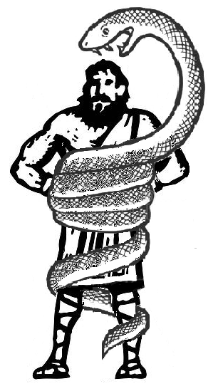

# IVS projekt 2

    <h1>Calcules</h1>
    

    
     
    

## Made with and for:

*Python*
*Windows 64bit*

## Authors:

*PyJaMa's*

- xkoren10 Matej Koreň
- xhloze02 Matej Hložek
- xtissm00 Marek Tišš

## License:

GNU General Public Licence

## Download:

Version 1.2 available here:
https://drive.google.com/file/d/1-pX3YnmUjhJSVMOgHaD32CQlmmYpaU07/view?usp=sharing

